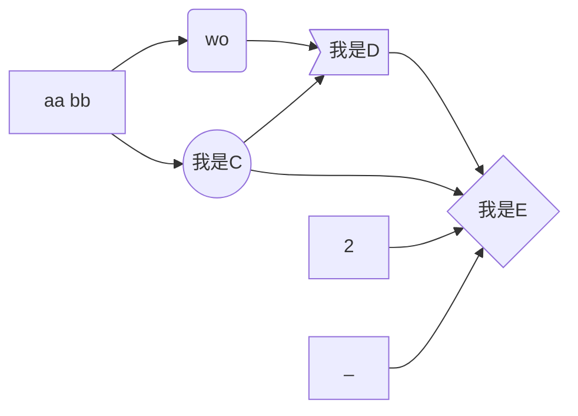

# 初识Opengl程序
## opengl 基本结构




* 初始化物体渲染所对应的状态
* 设置需要渲染的物体
## 基本概念
* 渲染:  表示计算机从模型创建到最终图像的过程。  
* 着色器: 看成是专为 GPU 编译的一种小型程序。  
## 命名规则
### 函数命名
* gl 开头前缀  
* 参数后缀, 举例  
    * glUniform2f :  代表参数是两个 float类型  
    * glUniform2fv:  代表参数是一个拥有两个float类型的vector
### 变量命令
GL_XXX
## Opengl管线过程
* 顶点数据
* 顶点着色器
* 细分控制着色器
* 细分计算着色器
* 几何着色器
* 图元设置
* 裁剪和剪切
* 光栅化
* 片元着色器

## 向OpenGL传输数据
### 缓存对象 BufferObject
由OpenGL维护的一块内存区域,典型函数为**glNamedBufferStorage**,用来设置缓存大小。
### 顶点着色
每个顶点，OpenGL都会调用一个顶点着色器来处理数据。顶点着色器可能会非常简单，例如只是传递顶点数据到下一个着色阶段;还有可能是经过计算，来得到顶点在屏幕中的位置。
### 细分着色
处理顶点着色器之后的数据，使用patch来描述一个物体的形状，会生成几何图元。
### 几何着色
对每一个几何图元进行进一步的处理，并生成新的图元。
### 图元装配
将顶点和几何图元之间组织起来，准备下一步操作。
### 剪切
保证Viewport之外的顶点不会被绘制
### 光栅化
是把顶点数据转换为片元的过程,具有将图转化为一个个栅格组成的图象的作用，特点是每个元素对应帧缓冲区中的一像素。
### 片元着色
决定某个片元的颜色应该是什么

# Opengl初始化过程
## glCreateVertexArrays
```c
void  glCreateVertexArrays(GLsizei n , GLuint* arrays);
```
返回N个未使用的对象名到arrays中,用作顶点对象。
## glBindeVertexArray
```c
void  glBindeVertexArray(GLuint array); 
```
绑定有上面Create函数创建的单个array对象。如果array不为0, 则执行bind操作，如果为0，则OpenGL将不再使用之前绑定的顶点。
## glDeleteVertexArrays
```c
void glDeleteVertexArrays(glSizei n , const GLuint *arrrays);
```
删除arrays 顶点数组
## gllsVertexArray
```c
void   glDeleteVertexArrays(Gluint array);
```
检查某个array是否在create之后没有被delete.

## 小结
以上是关于顶点的一些操作， 其对应的函数组  glCreate*,glBind*,glDelete*,glls* 会在其他地方有类似的应用。


